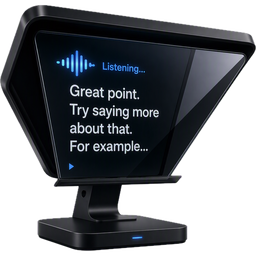
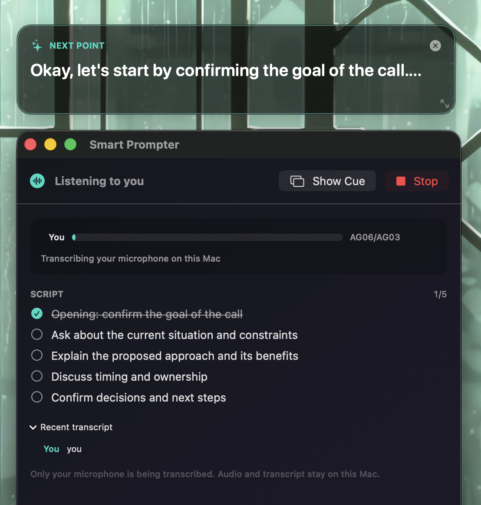

# Smart Prompter



I originally meant Smart Prompter to be a little demo of how much useful work Apple's on-device speech and language models can do, even on relatively low-end hardware. Then my NLP background got involved and the scope got a little out of hand--separate microphone and call-audio capture, multilingual transcription, fuzzy topic matching, model-assisted coverage tracking and a floating cue window all followed.

The app listens during video calls, follows a script of talking points and suggests a short next response. Its separate cue panel floats above the call while the main window handles setup, transcripts and manual corrections. Audio and transcripts stay on the Mac.



## Requirements

- macOS 26 and Xcode 26
- Apple Intelligence enabled for contextual coaching
- an on-device Speech recogniser for the selected locale

No cloud API or account is required. Audio and transcripts are not written to disk.

## Build and run

```sh
make test
make build
make run
```

`make build` selects the first valid Apple Development identity in the user keychain. The identity gives macOS a stable designated requirement and preserves privacy permissions when the executable changes. The build stops if no identity is available; it does not fall back to ad-hoc signing.

Set `CODE_SIGN_IDENTITY` when an Apple Development or Developer ID identity is already available:

```sh
CODE_SIGN_IDENTITY="Apple Development: Your Name (TEAMID)" make build
```

On first use, macOS asks for Speech Recognition, Microphone, and Screen & System Audio Recording access. If you deny one, enable it later in **System Settings → Privacy & Security**.

Enter one topic per line. Earlier topics are preferred when several points fit equally well, but conversation relevance can select a later point. Select a downloaded speech language and choose **Start listening**. The language menu keeps installed models in its short top-level list. **Get More Languages…** opens the full downloadable list; Smart Prompter installs a selected model when listening starts. Drag the semi-opaque cue panel by its background and resize it from any window edge or corner. **Show Cue** restores it after it has been hidden. Click a script item to mark or unmark it manually. Unchecking an automatically covered item keeps it manually uncovered for the rest of that listening session.

## How speaker labels work

ScreenCaptureKit supplies two distinct audio outputs:

- **You** — the selected microphone;
- **Call** — system audio, excluding Smart Prompter itself.

This signal-level split is fast and deterministic for calls. It does not identify individual remote participants. A meeting with several remote speakers will label all of them as **Call**.

Speech recognition is configured to run on-device. Topic coverage has a deterministic keyword fallback; when the system language model is available, Apple Intelligence adds contextual coaching. If Apple Intelligence is disabled, the app continues to show the next uncovered script item.
